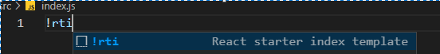
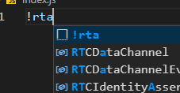

# Info

This is a simple react starter template creater with is very esay to use

# Usage

- You can simply use it by using **!rti** for index.js file and **!rta** for app.jsx or js file

# Preview

 
 
 
 

